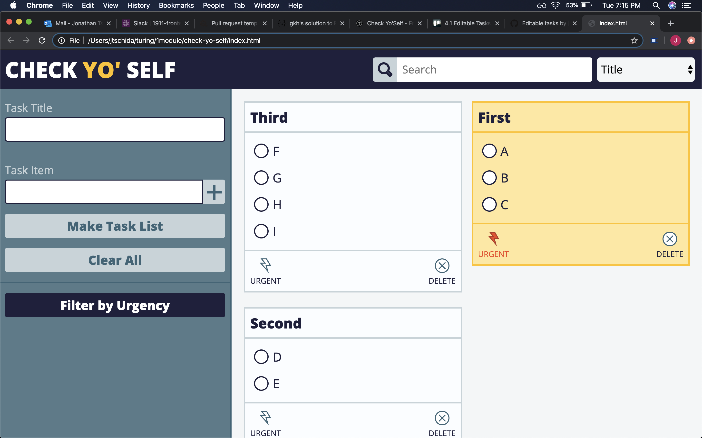

# Check Yo'Self

Mod 1 Solo Final Project

by [Jonathan Tschida](https://github.com/jonathan-tschida)

### Overview

This project was assigned as our final project for Mod 1 at Turing.  We were asked to create a web app that allows users to create to do lists where they can check off tasks, mark lists as urgent and delete to do lists once all tasks are checked. Additionally, users should be able to filter to do lists by urgency as well as search for to do lists based on the title.  The overall goal of this project was to demonstrate our ability to create well-written javascript that utilizes DOM manipulation, data modeling (through the use of classes), and data persistence (through the use of localStorage).

The UI was created with a combination of HTML and CSS, with the functionality being provided by javascript.  The bulk of the functionality has to deal with storing and accessing data in localStorage.  The main technical challenge of this project was dealing with javascript objects as they were put in and out of storage.  At first I encountered issues with the objects losing their class, causing them to no longer have access to their methods, making the data model nearly obsolete.  The workaround for this was to re-instantiate the objects by passing the object back through the constructor of the class.  I am particularly pleased with how I wrote the search and filter functionality to work together to allow the user to get very specific with their searches.

### Screenshots

#### The Comp We Were Given

#### Finished Product

